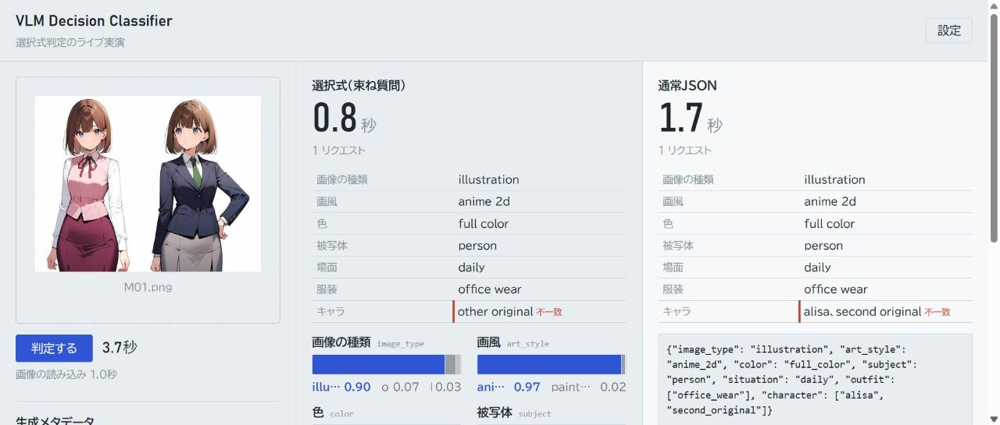
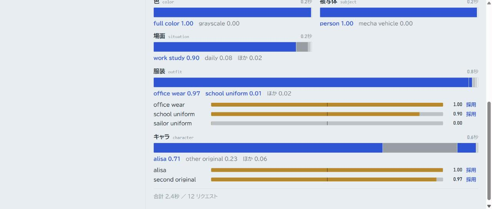
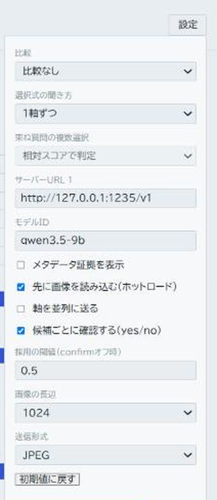

# VLM Decision Classifier

ローカルの視覚言語モデル（VLM）に画像と**選択式の質問**を渡し、回答ラベルの `logprobs` から候補間の相対スコアを読んで生成画像を分類する実験用リポジトリです。画像の生成メタデータから得たLoRA指定は、画素からの判定とは別の根拠として並べて表示します。

- [1. 概要と位置づけ](#1-概要と位置づけ)
- [2. 必要なもの](#2-必要なもの)
- [3. 導入](#3-導入)
- [4. モデルの用意](#4-モデルの用意)
- [5. まず動かす](#5-まず動かす)
- [6. おすすめの設定(速い構成)](#6-おすすめの設定速い構成)
- [7. オプション一覧](#7-オプション一覧)
- [8. デモUI](#8-デモui)
- [9. 実験の再現](#9-実験の再現)
- [10. 自分の画像・分類体系で試す](#10-自分の画像分類体系で試す)
- [11. 困ったとき](#11-困ったとき)
- [12. 結果の要約](#12-結果の要約)
- [13. リポジトリの構成とリンク](#13-リポジトリの構成とリンク)

## 1. 概要と位置づけ

本デモの狙いは、Jev的な選択式判定（回答ラベルの`logprobs`から候補間の相対スコアを読む方式）を、マルチモーダル入力・任意のローカルVLMに適用したときの挙動を確かめる**技術検証**です。分類の精度そのものを追い込むことや、メタデータ補助による精度向上は目的にしていません。数値は、方式がどう振る舞うかを見るための材料として読んでください。

発想の起点はJevと、[Google Gemmaが紹介した「DiffusionGemma as Jev」の投稿](https://x.com/googlegemma/status/2101069861598482817)です。紹介された[vLLMのPR #57250](https://github.com/vllm-project/vllm/pull/57250)は、DiffusionGemmaの出力キャンバスに回答スロットを設け、選択肢の分布を読み出す仕組みを示しています。このデモはJevやそのPRの実装を移植するものではありません。Qwen/Gemmaの**自己回帰VLM**へ画像と選択肢を送り、chat completionsの `logprobs`（先頭の回答トークン）を読む独立した実演です。「logprobsによる分類そのものが新発明」とは主張しません。

**議論の大前提**: 既存のVLMをJevのように使うと、画像を扱うための処理（画像の最初の読み込み、リクエストごとの画像の送り直しとキャッシュからの復元）が必ず乗ります。テキストだけのJevほどは速くなりません（Jevは同じ環境で測っていないので、速度の比較ではなく構造の話です）。詳しくは [`doc/experiments/report.md`](doc/experiments/report.md) §1.1 を参照してください。

**現状**: Phase 5（レポート・公開準備）まで進み、E1〜E5（Qwen/Gemma、通常JSONとの比較、llama.cpp画像キャッシュ改造の比較）、E9（ホットロード・確認のオン・オフ・軸の並列）、E7（束ね質問、送信画像の形式と長辺）、E7e（束ね質問の複数選択）の実験が済んでいます。その後、記事の本表として、1つのコミット・同じ条件で全条件を取り直し（最終の取り直し F1〜F3、各3回）、さらに小型モデル（Qwen3.5 4B/2B/0.8B、Gemma 4 E4B/E2B。S1〜S9）を比べました。`--prime` が通常JSONだけに効いていなかった不公平（PR #20で修正）が後で分かったため、F1〜F3とS1〜S9は修正後のコードで「準備なし・準備あり」の2条件に測り直しています（各1回。本表はこちら）。実測結果は [`doc/experiments/report.md`](doc/experiments/report.md) にあります（本表は §1.2、E1〜E9・E7は経緯として §4）。

何を実演するか:

1. `image_type`、`art_style`、`color`、`subject`、`situation`、`outfit`、`character` の7軸で画像を分類します。複数人の画像では、服装とキャラクターを複数選べます。
2. 自作キャラクター「Alisa」を、画像上の容姿と、PNG生成情報に記録されたAlisa用LoRA名（例: `fet-alisa-uniform-anima-v4u`）の二経路で調べます。LoRA名の記録は**生成時の指定の証拠**であり、実際にLoRAが効いたことや、そのキャラクターが画面に写っていることの証明ではありません。
3. 同じ専用画像データセットで、通常の**分類JSONを生成させる方式**と、回答ラベルの確率分布を読む**選択式方式**（1軸ずつ、または全軸を1リクエストに束ねる方式）の正答率・所要時間・形式不正を比較します。
4. 通常版 **Qwen3.5 9B GGUF** と **Gemma 4 12B GGUF** を評価します。Qwenでは、llama.cppの画像キャッシュ改造の有無も比較します。

実験用画像は、このリポジトリのために新規生成したものです（元の画像管理プロジェクトの画像や既存の評価画像は含みません）。

## 2. 必要なもの

| 項目 | 内容 |
|---|---|
| OS | Windows 11 で確認。Linux / macOS は可搬性の対象（未検証） |
| Python | 3.11 以上（依存は `pillow`・`pyyaml`。開発用に `pytest`） |
| git | リポジトリの取得に使う |
| 推論サーバー | LM Studio、または llama-server（llama.cpp）。OpenAI互換の chat completions に接続する。**このツールはサーバーの起動・モデルのダウンロードをしない** |
| GPU / VRAM | RTX 3090 24GB で確認。Qwen3.5 9B（Q4_K_M、コンテキスト8192、並列4）を llama-server で載せたときの使用量は約6.8GB（RTX 3090で観測）、Gemma 4 12B は LM Studio の `lms ps` で7.56GB。8GB以上の空きがあれば載る見込みだが、それ未満のGPUでは確認していない |

実験の再現（§9）には、GPUに他のプロセスがいない状態が望ましいです（速度が揺れるため）。

## 3. 導入

リポジトリを取得して、Python 3.11 以上の仮想環境を作り、パッケージを入れます。

Windows（PowerShell）:

```powershell
git clone https://github.com/Yumeno/vlm-decision-classifier.git
cd vlm-decision-classifier
py -3.12 -m venv .venv
.venv\Scripts\python.exe -m pip install -e ".[dev]"
```

Linux / macOS（bash）:

```bash
git clone https://github.com/Yumeno/vlm-decision-classifier.git
cd vlm-decision-classifier
python3 -m venv .venv
.venv/bin/python -m pip install -e ".[dev]"
```

- `py -3.12` は、既定の `python` が新しすぎる/古い開発機の事情による指定です。3.11 以上の `python` があればそれで構いません。
- 以降のコマンドは、リポジトリのルートで実行します（`check-manifest` と `evaluate` は、画像パスをカレントディレクトリ基準で解決します）。Windowsの例は `.venv\Scripts\python.exe`、Linux / macOS では `.venv/bin/python` に読み替えてください。パスの区切りも `\` → `/` です。
- 動作確認（サーバー不要。偽バックエンドのみ使用）: `.venv\Scripts\python.exe -m pytest -q`

## 4. モデルの用意

モデル重み・視覚プロジェクタ（mmproj）はリポジトリに同梱しません。Hugging Face から取得します。SHA256・リビジョンは [`doc/experiments/report.md`](doc/experiments/report.md) §2 と [`doc/experiments/runtime/`](doc/experiments/runtime/) の JSON に記録しています（ダウンロード後に照合してください）。

| モデル | Hugging Face リポジトリ | GGUF | mmproj |
|---|---|---|---|
| Qwen3.5 9B（公式 `Qwen/Qwen3.5-9B`） | `lmstudio-community/Qwen3.5-9B-GGUF` | `Qwen3.5-9B-Q4_K_M.gguf` | `mmproj-Qwen3.5-9B-BF16.gguf` |
| Gemma 4 12B（公式 `google/gemma-4-12B-it`） | `lmstudio-community/gemma-4-12B-it-GGUF` | `gemma-4-12B-it-Q4_K_M.gguf` | `mmproj-gemma-4-12B-it-BF16.gguf` |

### LM Studio で使う

1. LM Studio のモデル検索で上のリポジトリを探して取得する（同じリポジトリの mmproj も一緒に取得される）。GGUFはLM Studioのモデルフォルダに置かれる。
2. 何かをロードしていないか確認する（他のプロジェクトのモデルが載っていると押し出しや VRAM 不足の原因になる）。

   ```powershell
   lms ps
   ```

3. ロードする。実験では次のコマンドで、LM Studioの既定の GPU オフロード（最大）・コンテキスト 8192・並列 4 になっていた（`lms ps` で確認できる）。

   ```powershell
   lms load qwen3.5-9b --identifier qwen3.5-9b -y
   lms load gemma-4-12b-it --identifier gemma-4-12b-it -y
   ```

4. **モデルID**は `--identifier` の値（上の例では `qwen3.5-9b`、`gemma-4-12b-it`）で、`lms ps` の表示、または `GET http://127.0.0.1:1234/v1/models` で確かめる。以降の `--model` にこの値を渡す。

   コンテキスト長や並列数が違っていたら、LM Studio のモデルのロード設定で 8192 / 4 にそろえる。

### llama-server で使う（任意）

LM Studio の代わりに llama-server を使うこともできます。`--base-url http://127.0.0.1:1235/v1` のようにサーバーの場所を渡すだけです。画像キャッシュ改造版のビルドと起動引数は §6 と [`doc/experiments/phase4-runbook.md`](doc/experiments/phase4-runbook.md) にあります。

### `reasoning_effort: "none"` が必要な理由

`probe`/`classify`/`evaluate`/`serve` は、既定でリクエストに `reasoning_effort: "none"` を含めます。これを外すと、Qwen/Gemmaともthinking（考える出力）が先に出て、1トークン目で回答ラベルの logprobs が取れません（2026-09-24のprobeで確認）。サーバーが `reasoning_effort` を拒否して400を返したときは、外して再送し、その事実を記録します（別方式へのフォールバックはしません）。

ダウンロードした GGUF と mmproj は、`doc/experiments/runtime/*.json` に記録した SHA256 と照合してから使ってください(実験で使ったファイルと同じかどうかの確認にもなります)。

## 5. まず動かす

LM Studio にモデルをロードした状態で、次の順に実行します。`<モデルID>` は §4 で確かめた値です。接続先の既定は `http://127.0.0.1:1234/v1`（LM Studio）で、変えるときは `--base-url` を付けます。

1. **probe**: 接続・vision・logprobs の疎通確認（赤い64x64の画像で回答ラベルと logprobs を試す）。

   ```powershell
   .venv\Scripts\python.exe -m classifier_demo probe --model <モデルID>
   ```

   `answer:` と `relative_scores:` が出て、`logprobs present: yes`、`thinking detected: no`、`reasoning_effort dropped: False` なら準備完了です。

2. **1枚を分類**（既定は1軸ずつの選択式）。`--output` を省略すると結果JSONを標準出力に出します。

   ```powershell
   .venv\Scripts\python.exe -m classifier_demo classify dataset\images\M01.png --model <モデルID> --output results\demo.json
   ```

   通常JSONで分類するなら `--mode json`、束ね質問なら `--mode bundled`、通常JSONと同じ質問にllama-serverの制約付きデコード(JSONスキーマ)を掛けるなら `--mode json_schema`。

3. **manifestの検証**（画像の存在・SHA256・正解ラベルの整合）:

   ```powershell
   .venv\Scripts\python.exe -m classifier_demo check-manifest --manifest dataset\manifest.jsonl
   ```

   最後に `OK` が出ます。

4. **データセット全件の評価**（内部で `check-manifest` を先に実行し、エラーがあれば中断）。これは選択式と通常JSONの対応比較で、確認オフ・JPEGの既定のままの最小の形です。

   ```powershell
   .venv\Scripts\python.exe -m classifier_demo evaluate --manifest dataset\manifest.jsonl --model <モデルID> --output-dir results\my_first_run
   ```

`--output-dir` には次のファイルが書き出されます。

| ファイル | 内容 |
|---|---|
| `run.json` | 実行条件（モデル、モード、画像の形式・長辺、確認の有無、manifest・taxonomyのSHA256、ツールのコミット、OS・Pythonなど）、除外ケース（`excluded_cases`）。`--runtime-info` を渡すとその中身も記録 |
| `cases.csv` | ケース別の予測と採点、時間、リクエスト数 |
| `summary.md` | 軸別の精度、候補別のTP/FP/FN、メタデータの一致率、処理時間、失敗の一覧 |
| `cases/<case_id>.<mode>.json` | 生の分類結果 |

- `rights_confirmed` が true でないケースは評価から除外され、理由とともに `run.json` に記録されます。
- 推論失敗・形式不正のケースも評価の分母に残ります。1件の失敗で全件は止まりません。
- 評価前に、ウォームアップ1回（`--warmup 1`）を別記録で行います（分類時間には含めません）。
- `results/` はGit管理外です。公開するときは個人のパスを除いて `doc/experiments/` に写します。

## 6. おすすめの設定(速い構成)

小標本での実測に基づく、速い構成です（Qwen3.5 9B、改造版 llama-server、RTX 3090。根拠は [`report.md`](doc/experiments/report.md) §1.2（測り直し）と §4.6〜§4.10（経緯））。

- **サーバー**: llama.cpp の画像キャッシュ改造版 llama-server（`doc/patches/llamacpp-mtmd-checkpoint.patch`、上流 `f95b0d9` に当てる1行）。ビルド手順は [`doc/experiments/phase4-runbook.md`](doc/experiments/phase4-runbook.md) §1。起動引数（`doc/experiments/runtime/qwen-llamaserver-patched.json` の記録）:

  ```
  llama-server -m Qwen3.5-9B-Q4_K_M.gguf --mmproj mmproj-Qwen3.5-9B-BF16.gguf --alias qwen3.5-9b -ngl 99 -c 8192 -np 4 --kv-unified -sm none -mg 0 --port 1235
  ```

  `--alias` が `--model` に渡すモデルIDになります。`-sm none -mg 0` は1枚のGPUに載せる指定で、番号はCUDAの並び順です（§11）。改造版でなくても動きますが、選択式（1軸ずつ）は遅くなります（測り直しで、1軸ずつ（確認オフ）は未改造版5.16秒 → 改造版1.89秒（初めて見る画像）、5.12秒 → 1.29秒（読み込み済み）。F2/F1、長辺1024。判定は変わらない）。
- **質問方式**: `--modes bundled`（全軸を1リクエストで答えさせる束ね質問）。方式を比べるなら `--modes choice,json,bundled`（ケースごとに実行順を回転します）。
- **`--prime`**: 各画像で、方式ごとに判定の直前に準備リクエストを1回送り、画像をサーバーのキャッシュに載せます（方式ごとに自分の質問形式で準備します。PR #20）。準備の時間は `prime_ms` として、判定時間（`classification_wall_ms`）とは別に記録されます。付けなければ「初めて見る画像」の判定時間（画像の読み込みを含む）になります。
- **送信画像**: JPEG（quality 90、長辺1024）が既定です。長辺は `--max-edge 768` で下げられます（準備＝画像の読み込みが、F1で束ね（順位付け）0.64秒 → 0.49秒、JSON 0.81秒 → 0.58秒）。
- **複数選択の軸（服装・キャラ）**: 順位付けの相対スコアは候補どうしで合計1を取り合うので、2つ以上写る画像を取りこぼします。拾いたいときは `--bundled-multi yn`（束ね質問の中で候補ごとのY/N欄にします）。

```powershell
.venv\Scripts\python.exe -m classifier_demo evaluate --manifest dataset\manifest.jsonl --base-url http://127.0.0.1:1235/v1 --model qwen3.5-9b --modes choice,json,bundled --prime --bundled-multi yn --output-dir results\fast
```

実測の目安（測り直し F1。Qwen3.5 9B Q4_K_M、改造版llama-server、JPEG 1024、元画像31件、各条件1回。「初めて見る画像」は画像の読み込みを含む判定時間、「読み込み済み」は `--prime` で準備した後の判定時間）:

| 方式 | 初めて見る画像 | 読み込み済み | 備考 |
|---|---:|---:|---|
| 束ね質問（順位付け、`--bundled-multi rank`） | 1.19秒 | 0.71秒 | リクエスト1回 |
| 通常JSON | 1.62秒 | 0.96秒 | 平均約55トークンの生成時間が大半 |
| 1軸ずつ（確認オフ） | 1.89秒 | 1.29秒 | リクエスト7回 |
| 束ね質問（Y/N欄、`--bundled-multi yn`） | 1.62秒 | 1.28秒 | リクエスト1回。キャラは31/31 |
| 1軸ずつ（確認オン） | 2.67秒 | 2.00秒 | リクエスト約11回 |

束ね質問（順位付け）は、通常JSONより2〜3割短い（全12条件（F1〜F3×長辺2×準備なし/あり）で14〜33%）。1軸ずつ（確認オフ）は通常JSONより遅い（1.14〜3.31倍）。準備（画像の読み込み）は別に0.41〜0.81秒（F1 長辺1024、方式ごと）です。各条件1回の測定で、判定は `temperature=0` で決定的です（旧の3回測定では判定が変わりませんでした）。
**小型モデル**（Qwen3.5 4B/2B/0.8B、Gemma 4 E4B/E2B）では、1軸ずつの選択式が頑健でした（0.8Bでも単一選択5軸の平均86.5〜87.1%）。束ね質問はモデルが回答の形式を守れるかに左右され、小さいほど形式不正が増えます（Qwen 4Bは全件が形式不正）。小型で速さを取るなら、まず1軸ずつです（時間はJSONと同程度。詳細は §12、report §1.3）。

## 7. オプション一覧

既定値は `classifier_demo/__main__.py` と `scripts/benchmark_cache.py` の実装のとおりです。

**既定が変わったもの**: (1) 複数選択軸の候補ごとのyes/no確認は**既定オフ**（`--confirm` でオン）。(2) 送信画像は**既定でJPEG**（quality 90）。E1〜E5・E9・E7a/b はPNG・長辺1024で測りました（E7c/d はJPEG）。E1〜E5、E9a/b/b2/e は確認オン、E9c と E7a/b は確認オフです。そのため **E1〜E5・E9・E7a/b の再現には `--image-format png` が必要で、E1〜E5・E9a/b/b2/e ではさらに `--confirm` が必要**です（§9）。

### 共通（`probe` / `classify` / `evaluate`）

| オプション | 既定値 | 意味 |
|---|---|---|
| `--base-url` | `http://127.0.0.1:1234/v1` | OpenAI互換サーバーのURL（LM Studioの既定ポート） |
| `--model` | （必須） | モデルID |

### `probe`

`--base-url`、`--model` のみ。

### `classify <image>`

| オプション | 既定値 | 意味 |
|---|---|---|
| `image`（位置引数） | （必須） | 分類する画像のパス |
| `--mode` | `choice` | `choice`（1軸ずつの選択式）/ `json`（通常JSON）/ `bundled`（束ね質問） |
| `--taxonomy` | `taxonomy/default.yaml` | 分類体系のYAML |
| `--max-edge` | `1024` | モデルへ送る画像の長辺（px） |
| `--image-format` | `jpeg` | `jpeg`（quality 90）/ `png`。E1〜E9の再現には `png` |
| `--confirm` | オフ | 複数選択軸で上位候補ごとにyes/noを確認する（リクエストが増える）。E1〜E4等はこの方式 |
| `--rank-threshold` | `0.5` | `--confirm` なしのとき、複数選択軸で採用する相対スコアの閾値 |
| `--bundled-multi` | `rank` | 束ね質問での複数選択軸の扱い。`rank`=相対スコアと閾値、`yn`=候補ごとのYes/No欄（E7e） |
| `--output` | （標準出力） | 結果JSONの書き出し先（親フォルダがなければ作る） |

### `check-manifest`

| オプション | 既定値 | 意味 |
|---|---|---|
| `--manifest` | `dataset/manifest.jsonl` | 検証するmanifest |
| `--taxonomy` | `taxonomy/default.yaml` | 正解ラベルの照合に使う分類体系 |

### `evaluate`

`--base-url`、`--model`（必須）に加えて:

| オプション | 既定値 | 意味 |
|---|---|---|
| `--manifest` | `dataset/manifest.jsonl` | 評価するmanifest |
| `--modes` | `choice,json` | カンマ区切りで `choice` / `json` / `bundled` / `json_schema`（制約付きデコードのJSON。E10）（重複不可）。2モードはケースごとに順序を交互に、3モード以上は回転して実行 |
| `--taxonomy` | `taxonomy/default.yaml` | 分類体系 |
| `--max-edge` | `1024` | 送信画像の長辺 |
| `--image-format` | `jpeg` | `jpeg` / `png` |
| `--warmup` | `1` | 評価前のウォームアップ回数（分類時間に含めず別記録） |
| `--runtime-label` | なし | 実行環境のラベル（`run.json`に記録） |
| `--runtime-info` | なし | 実行環境を記したJSON（モデル/mmprojのSHA256、サーバーのcommit、パッチ、起動引数、GPUなど）。ファイル名とSHA256を添えて `run.json` にそのまま記録。例は `doc/experiments/runtime/*.json` |
| `--dataset-version` | なし | データセット版（例 `v1.0.0`）。`DATASET_CARD.md` と照合し `run.json` に記録 |
| `--note` | なし | 任意のメモ（`run.json`に記録） |
| `--output-dir` | （必須） | 出力先フォルダ |
| `--prime` | オフ | 各ケースの判定前に画像だけの準備リクエストを1回送る（ホットロード）。`prime_ms` を別記録 |
| `--axis-concurrency` | `1` | `choice` で軸ごとの質問を同時に送る数（1=逐次）。サーバーの対応スロット数が前提。`--prime` と併用（N≥2）すると準備をN本同時に送る |
| `--confirm` | オフ | `classify` と同じ |
| `--rank-threshold` | `0.5` | `classify` と同じ |
| `--bundled-multi` | `rank` | `classify` と同じ |

### `serve`

| オプション | 既定値 | 意味 |
|---|---|---|
| `--port` | `8765` | デモUIの待ち受けポート（`127.0.0.1` 固定。使用中ならエラー） |
| `--taxonomy` | `taxonomy/default.yaml` | 分類体系 |

### Jev 風の呼び出し(System One 形式、実験的)

TypeSafe の Jev SDK(`typesafe-sdk`)と同じ呼び出しの形で、手元の VLM を呼べる最小クライアント(`classifier_demo/systemone.py`)。SDK には依存せず、名前とフィールドを写しただけで、TypeSafe 社とは無関係。

```python
from classifier_demo.systemone import SystemOneClient

client = SystemOneClient(base_url="http://127.0.0.1:1234/v1", model="<モデル名>")
r = client.system_one(
    state="顧客からの問い合わせ文...",
    questions={
        "dept": {"type": "choice", "instructions": "担当部署は?", "criteria": {"returns": "返品", "billing": "請求"}},
        "urgent": {"type": "noul", "instructions": "緊急か?"},
        "tone": {"type": "score", "instructions": "怒りの強さは?", "criteria": ["平静", "不満", "激怒"]},
    },
    images=["photo.png"],  # 本実装の拡張(Jev 本体は画像を受け付けない)
)
r.choices["dept"].choice, r.choices["dept"].probabilities, r.nouls["urgent"].noul, r.scores["tone"].score
```

CLI(手動確認用): `python -m classifier_demo systemone --base-url ... --model ... --questions q.json [--state TEXT | --state-file F] [--image PATH ...] [--prime]`。`q.json` は `{質問名: {type, instructions, criteria}}`。

| Jev の質問 | 本実装 | 返すもの |
|---|---|---|
| `choice` | ラベル `A`〜`Z`,`a`〜`z` を順に割り当て、1質問1リクエスト(`max_tokens=1`, `top_logprobs=20`) | `choice`、`probabilities` |
| `noul` | yes/no(`A`/`B`)の2択 | `noul`(yes の相対スコア) |
| `score`(2〜10段階。`criteria` は順序付きリスト) | n 段階ならラベル `0`〜`n-1` | `score`(0〜n-1 の目盛りでの、相対スコアで重み付けした期待値)、`legend`、`probabilities` |

質問は SDK の形の素の dict で渡す(SDK の `Choice`/`Noul`/`Score` ヘルパークラスは受け付けない)。選択肢名・説明・instructions の改行や制御文字は空白にして1行にする。先頭(system → 画像 → state)を全質問で共有し、質問は互いに見えない(束ねない)。`prime=True` で先頭だけのリクエストを先に送れる(時間は `usage.prime_elapsed_ms` に別記録)。

限界:

- `probabilities` / `noul` / `score` は候補内で割り直した**相対スコア**で、較正されていない(正答確率ではない)。較正(正解付きデータで温度などを合わせる)は提供しない。
- 全候補を観測できるのは20候補以内(`top_logprobs` が上位20件。`A` と ` A` のような表記ゆれも枠を使う)。
- choice は最大52ラベル(Jev は255)。超過は明示エラー。ラベルトークンが出ない・thinking が先に出る・logprobs 欠損も `SystemOneError`(任意の選択肢には強制しない)。
- `confidence` は返さない(公式文書で算出式を確認できないため。`probabilities` から計算する)。
- `images` は本実装の拡張で、TypeSafe の Jev 本体は画像を受け付けない。形式は openjev の `images`(`data:image/...;base64,` URL、または `{"content_type", "base64"}`)と同じで、加えてファイルパスと bytes も受ける。8枚まで・1枚5MiBまで・jpeg/png/webp/gif のみ(違反は明示エラー)。openjev はサーバー側でリサイズしないが、本実装は既存実験と揃えるため送信前に `prepare_image`(長辺 `--max-edge`、既定 jpeg q90)を通す。
- 複数選択は Jev にない。本リポジトリの `classify` / 確認(yes/no)を使う。

### `scripts/benchmark_cache.py`（E5: 画像キャッシュ改造の再現用ベンチマーク）

未改造版・改造版のllama-serverを別々に起動して、それぞれで実行します（サーバーの起動・切り替えは利用者が行います）。

| オプション | 既定値 | 意味 |
|---|---|---|
| `--base-url` | `http://127.0.0.1:1234/v1` | サーバーURL |
| `--model` | （必須） | モデルID |
| `--images IMAGE_A IMAGE_B` | `dataset/images/M01.png dataset/images/G05.png` | 1枚目がA、2枚目がB |
| `--repeats` | `3` | 繰り返し回数 |
| `--taxonomy` | `taxonomy/default.yaml` | 分類体系 |
| `--max-edge` | `1024` | 送信画像の長辺 |
| `--image-format` | `jpeg` | `jpeg` / `png`。E5の再現には `png` |
| `--label` | なし | 実行の識別ラベル（例 `vanilla` / `patched`） |
| `--output` | （必須） | 出力JSONのパス |

## 8. デモUI

軸ごとにスコアが伸びる様子をライブで見せるための1画面UIです（動画収録用）。標準ライブラリのみのサーバー（`http.server`）が静的ファイルを配信し、判定はNDJSONでストリーム配信します。待ち受けは `127.0.0.1` 固定で、外部には公開しません。

```powershell
.venv\Scripts\python.exe -m classifier_demo serve --port 8765
```

- 起動前に、LM Studio / llama-server でモデルをロードしておきます（`serve` 自体はサーバーもモデルも起動しません）。
- ブラウザで `http://127.0.0.1:8765/` を開き、右上の「設定」でサーバーURL・モデルIDを指定してから、画像をドロップして「判定する」を押します。
- 使用中のポートを指定すると、エラーで終了します（`--port` で別の番号を指定してください。§11）。
- 接続先はこのPC上のサーバーだけ（ループバック）で、Host/Origin不一致やループバック以外の `base_url` は拒否します。



*束ね質問(順位付け、0.8秒・1リクエスト)と通常JSON(1.7秒)の比較。M01(Alisa と second original の2人)で、画像を先に読み込み済み。キャラの行に「不一致」の印: 順位付けは相対スコアを候補どうしで取り合うため other original の1つだけを選び、JSON は2人とも挙げた。2人を拾うには「束ね質問の複数選択」を「候補ごとに Y/N」にする(E7e)。*



*1軸ずつ・候補ごとに確認(yes/no)オンの服装とキャラの軸。青い帯が順位付けの相対スコア(キャラは alisa 0.71 に偏る)、黄土色の棒が候補ごとの P(yes)(縦線が 0.5)。確認では alisa と second original の両方が採用された。*

### 設定項目

| 項目 | 内容 |
|---|---|
| 比較 | 「比較なし」（既定）/「選択式 と 通常JSON」（同じ画像を選択式→通常JSONの順に実行し、左右にスコア帯とJSON生テキスト・ラベル・所要時間を並べる。同時実行はしない）/「サーバー1 と サーバー2」（未改造/改造のllama-serverなど2つのサーバーURLに選択式を順に流して時間を比べる） |
| 選択式の聞き方 | 「1軸ずつ」（既定）/「束ね質問（1リクエストで全軸）」 |
| 束ね質問の複数選択 | 「相対スコアで判定」（既定）/「候補ごとに Y/N」（`--bundled-multi yn`と同じ） |
| サーバーURL 1・2 / モデルID | 接続先とモデルID（サーバーURL 2は比較で「サーバー1 と サーバー2」を選んだときだけ使う） |
| メタデータ証拠を表示 | ON: PNG生成メタデータ由来のLoRA名・トリガーワード・キャラ一致と、画素からのキャラ判定を並べ、一致/不一致を表示（`metadata_evidence`と`vision_tags`は統合せず別フィールドのまま） |
| 先に画像を読み込む（ホットロード） | ON: 判定前に準備リクエストを1回送り、画像をサーバーのキャッシュに載せる（比較では全列に付ける。選択式とJSONは先頭が違い、サーバー1と2は別サーバーなので、各列が自分の準備を送る）。所要時間は画像欄の下に小さく表示し、列の経過時間には含めない |
| 軸を並列に送る | ON: 1軸ずつの質問を4並列で送る（サーバーが`-np 4`など対応スロット数を用意している前提。E9では得にならなかった） |
| 候補ごとに確認する（yes/no） | 既定OFF。ONなら複数選択軸で候補の順位付けのあとに候補ごとのyes/no確認（P(yes)）を表示。OFFなら、スコア帯の上に「採用の閾値」の位置を縦線で示す |
| 採用の閾値（confirmオフ時） | 既定0.5。`--rank-threshold`と同じ |
| 画像の長辺 | 1024（既定）/ 768 |
| 送信形式 | JPEG（既定）/ PNG |

設定はブラウザに保存され、次回開いたときに復元されます。設定パネルの「初期値に戻す」で初期値に戻せます。



各結果列は「経過時間・リクエスト数 → 判定結果の表（7軸を1行ずつ） → 出力の中身（スコア帯・yes/no、またはJSON生テキスト）」の順に並びます。比較では、両方の列がそろった時点で、左右のラベルが異なる軸の行に印（左罫線+「不一致」表示）を付けます。失敗（選択肢トークンが出ない・thinkingが先に出る・logprobs欠損・通信エラー・JSON形式不正など）は、例外で止めずにその場に理由を表示し、別方式へのフォールバックはしません。

## 9. 実験の再現

- 前提は、データセット v1.0.0（`dataset/manifest.jsonl`）、taxonomy 0.4.1（現在の `taxonomy/default.yaml`）、リポジトリのルートから実行、`--dataset-version v1.0.0`。結果は `results/<名前>/` に出し、公開用のものを `doc/experiments/` に写しています。
- **E1/E1-J/E2/E2-J は taxonomy 0.4.0** で測ったので、再現には当時の `taxonomy/default.yaml`（git履歴。SHA256 `ec7b2a2f…` で確認）を `--taxonomy` に渡す必要があります。現在の `default.yaml` は 0.4.1 です（E1b/E2b と同じ）。
- E1b以降は、RTX 3090に他のプロセスがない状態で測りました（E1/E1-J/E2/E2-Jは別プロジェクトのllama-serverが常駐した状態。report §2）。

| 実験ID | 何を測ったか | コマンドまたは手順書 | 結果フォルダ |
|---|---|---|---|
| E1 / E1-J | Qwen3.5 9B（LM Studio）の選択式と通常JSON。taxonomy 0.4.0 | [`phase3-runbook.md`](doc/experiments/phase3-runbook.md) | `E1_qwen-lmstudio/` |
| E2 / E2-J | Gemma 4 12B（LM Studio）の選択式と通常JSON。taxonomy 0.4.0 | 同上（Gemmaの引数はrunbook） | `E2_gemma-lmstudio/` |
| E1b / E2b | E1/E2の再評価（taxonomy 0.4.1）。`--runtime-label qwen-lmstudio-tax041`（Gemmaは `gemma-lmstudio-tax041`）、`--output-dir results/E1b_qwen-lmstudio`（`E2b_gemma-lmstudio`） | 同上（`--taxonomy` は既定の0.4.1） | `E1b_qwen-lmstudio/`、`E2b_gemma-lmstudio/` |
| E3 / E4 | llama-server（未改造/改造）でQwenの選択式（全件）。パッチの効果 | [`phase4-runbook.md`](doc/experiments/phase4-runbook.md) §3 | `E3_qwen-llamaserver-vanilla/`、`E4_qwen-llamaserver-patched/` |
| E5 | 同じ画像で質問だけ変える／画像切替A→B→Aの小ベンチマーク | 下記 | `E5_qwen-llamaserver/`（`vanilla.json`/`patched.json`） |
| E9a〜E9e | ホットロード、確認のオン・オフ、軸の並列（改造版llama-server） | 下記 | `E9a_…`〜`E9e_…` |
| E7a〜E7e | 束ね質問、送信画像の形式・長辺、束ね質問の複数選択（Y/N欄） | 下記 | `E7a_…`〜`E7e_…` |
| F1〜F3（最終の取り直し、旧測定） | Qwen改造・Qwen未改造・Gemma改造 × 長辺1024/768 × 回a/b × 3回（36回）。`--prime` がJSONだけに効いていなかった測定（時間比較は不公平、精度は同じ） | [`final-runbook.md`](doc/experiments/final-runbook.md)、`scripts/run_final_matrix.sh` | `final/` |
| F1〜F3（測り直し。本表） | 同じ条件を、準備の不公平の修正後に準備なし・準備ありで各1回（24実行） | 下記、`scripts/run_final_matrix.sh` | `reprime/final_noprime/`、`reprime/final_prime/` |
| S1〜S9（小型モデル、旧測定） | 小型モデル9種の比較（F1〜F3と同じ手順、繰り返し1回。準備の不公平あり） | `scripts/run_small_matrix.sh` | `small/` |
| S1〜S9（測り直し。本表） | 同じ条件を準備なし・準備ありで各1回（36実行） | 下記、`scripts/run_small_matrix.sh` | `reprime/small_noprime/`、`reprime/small_prime/` |

### E1 / E1-J / E2 / E2-J（Phase 3。LM Studio）

コマンドは [`phase3-runbook.md`](doc/experiments/phase3-runbook.md) §手順5 のとおりです。Qwenの例（`--confirm --image-format png` が必要）:

```powershell
.venv\Scripts\python.exe -m classifier_demo evaluate --manifest dataset\manifest.jsonl --model qwen3.5-9b --modes choice,json --warmup 1 --confirm --image-format png --dataset-version v1.0.0 --runtime-info doc\experiments\runtime\qwen-lmstudio.json --runtime-label qwen-lmstudio --output-dir results\E1_qwen-lmstudio
```

Gemmaは `--model gemma-4-12b-it --runtime-info doc\experiments\runtime\gemma-lmstudio.json --runtime-label gemma-lmstudio --output-dir results\E2_gemma-lmstudio`。E1b/E2b は同じコマンドで、上表の `--runtime-label` と `--output-dir` にします。

### E3 / E4（Phase 4。llama-server 未改造/改造）

未改造版と改造版を同じコミット・同じビルド手順で作り（[`phase4-runbook.md`](doc/experiments/phase4-runbook.md) §1）、1台ずつ起動して測ります（§2〜§3）。`--confirm --image-format png` が必要:

```powershell
.venv\Scripts\python.exe -m classifier_demo evaluate --manifest dataset\manifest.jsonl --base-url http://127.0.0.1:1235/v1 --model qwen3.5-9b --modes choice --warmup 1 --confirm --image-format png --dataset-version v1.0.0 --runtime-info doc\experiments\runtime\qwen-llamaserver-vanilla.json --runtime-label qwen-llamaserver-vanilla --output-dir results\E3_qwen-llamaserver-vanilla
```

改造版（E4）は `--runtime-info doc\experiments\runtime\qwen-llamaserver-patched.json --runtime-label qwen-llamaserver-patched --output-dir results\E4_qwen-llamaserver-patched`。

### E5（画像キャッシュ改造の小ベンチマーク）

サーバーごとに1回ずつ（PNGで測りました）:

```powershell
.venv\Scripts\python.exe scripts\benchmark_cache.py --base-url http://127.0.0.1:1235/v1 --model qwen3.5-9b --label vanilla --image-format png --output results\E5\vanilla.json
```

改造版は `--label patched --output results\E5\patched.json`。

### E9a〜E9e（ホットロード・確認・軸の並列。改造版llama-server）

サーバーは §6 の起動引数（E9eだけ `--no-cache-idle-slots` を追加）で、**条件ごとに再起動**します。共通部分（**`--image-format png` が必要**）:

```powershell
.venv\Scripts\python.exe -m classifier_demo evaluate --manifest dataset\manifest.jsonl --base-url http://127.0.0.1:1235/v1 --model qwen3.5-9b --modes choice,json --warmup 1 --prime --image-format png --dataset-version v1.0.0 --runtime-info doc\experiments\runtime\qwen-llamaserver-patched.json <条件> --output-dir results\<名前>
```

| 実験 | `<条件>` |
|---|---|
| E9a（確認オン・逐次） | `--confirm --axis-concurrency 1` |
| E9b（確認オン・並列4、準備1本）、E9b2（同・準備4本同時）、E9e（同・準備4本同時。サーバーを `--no-cache-idle-slots` で起動） | `--confirm --axis-concurrency 4` |
| E9c（確認オフ・逐次） | `--axis-concurrency 1 --rank-threshold 0.5` |

（E9b と E9b2 は、後者だけ並列準備の修正後のコミット `acfe504` で測っています。準備の本数は `--prime` と `--axis-concurrency N` の併用で N 本になります。）

### E7a〜E7e（束ね質問・送信画像・Y/N欄。改造版llama-server）

確認オフ（閾値0.5）。サーバーは条件ごとに再起動。共通部分:

```powershell
.venv\Scripts\python.exe -m classifier_demo evaluate --manifest dataset\manifest.jsonl --base-url http://127.0.0.1:1235/v1 --model qwen3.5-9b --modes choice,json,bundled --warmup 1 --prime --axis-concurrency 1 --rank-threshold 0.5 --dataset-version v1.0.0 --runtime-info doc\experiments\runtime\qwen-llamaserver-patched.json <条件> --output-dir results\<名前>
```

| 実験 | `<条件>` | 備考 |
|---|---|---|
| E7b（番号付き・PNG1024） | `--image-format png --max-edge 1024` | |
| E7c（JPEG1024） | `--image-format jpeg --max-edge 1024` | |
| E7d（JPEG768） | `--image-format jpeg --max-edge 768` | |
| E7e（束ね質問の複数選択をY/N欄に） | `--image-format jpeg --max-edge 1024 --bundled-multi yn` | |
| E7a（記号のみ・空白区切り、PNG1024） | コミット `cc427e6` をチェックアウトして実行 | 束ね質問の回答形式を、のちに番号付きへ変えた（形式のずれが起きたため）ので、現在のコードでは再現できない。結果は比較には使っていない（report §4.7） |

測定時のコミット・時刻・条件は、各フォルダの `run.json`（`tool_commit`、`started`、`note` など）と [`report.md`](doc/experiments/report.md) §2、[`doc/worklog.md`](doc/worklog.md) にあります。
実験記録(`run.json` の `tool_commit` など)や worklog に残るコミット ID は、非公開の開発リポジトリのものです。この公開リポジトリでの対応するコミットは [`doc/commit-map.tsv`](doc/commit-map.tsv)(左が開発リポジトリ、右が公開リポジトリ)で引けます。

### F1〜F3（最終の取り直し）

旧測定（`--prime` の不公平あり。下記の測り直しが本表）です。手順の詳細は [`final-runbook.md`](doc/experiments/final-runbook.md)。3条件（F1 Qwen改造、F2 Qwen未改造、F3 Gemma改造）× 長辺2 × 回2 × 繰り返し3 = 36回を、繰り返しを一番外側にして回します（回ごとにサーバーを再起動）。llama.cppの `vanilla/`（未改造）と `patched/`（改造）をビルドして置いたフォルダ、Qwen・GemmaのGGUFフォルダを環境変数で渡します。Windows の Git Bash で、リポジトリのルートから:

```bash
LLAMACPP_DIR=<llama.cpp の置き場所> QWEN_DIR=<Qwen の GGUF のフォルダ> GEMMA_DIR=<Gemma の GGUF のフォルダ> bash scripts/run_final_matrix.sh
```

集計（各回の `results/final/<回>/` の `cases.csv`・`run.json` から、時間の平均±標準偏差・精度・失敗・繰り返しの揺れを出す）:

```powershell
.venv\Scripts\python.exe scripts\aggregate_final.py --input results\final --output doc\experiments\final
```

出力は `doc/experiments/final/summary.md` と `runs/`（各回の生データ）、`progress.log`。実行環境は `doc/experiments/runtime/final-*.json`（`--runtime-info` に渡したもの）です。

#### F1〜F3の測り直し（準備なし・準備あり。本表）

PR #20 で `--prime` を方式ごとの準備にしたあと、同じ手順で、準備なし（`PRIME=0`）と準備あり（`PRIME=1`）を1回ずつ測ります（`REPS=1`。絞り込みの `CONDITIONS`・`EDGES` は既定で全条件・長辺1024と768）。出力先は `OUT` で切り替えます（Git Bash、リポジトリのルートから）:

```bash
# 準備なし（画像の読み込みを判定時間に含む）
PRIME=0 REPS=1 OUT=results/reprime/noprime LLAMACPP_DIR=<llama.cpp の置き場所> QWEN_DIR=<Qwen の GGUF のフォルダ> GEMMA_DIR=<Gemma の GGUF のフォルダ> bash scripts/run_final_matrix.sh
# 準備あり（--prime。準備の時間は prime_ms に別記録）
PRIME=1 REPS=1 OUT=results/reprime/prime LLAMACPP_DIR=<llama.cpp の置き場所> QWEN_DIR=<Qwen の GGUF のフォルダ> GEMMA_DIR=<Gemma の GGUF のフォルダ> bash scripts/run_final_matrix.sh
```

各実行は `results/reprime/<noprime|prime>/<F1|F2|F3>_e<長辺>_<a|b>_r1/`。集計は `scripts/aggregate_final.py`（`--input` に上の出力先、`--output` に任意のフォルダ）で出せます。結果は `doc/experiments/reprime/summary.md` と、`final_noprime/`・`final_prime/` の `runs/`（`run.json`・`cases.csv`・`summary.md`）、`progress.log` です（`results/` の生出力そのものはコミットしていません）。

### S1〜S9（小型モデル）

旧測定（`--prime` の不公平あり）の手順です。F1〜F3と同じ手順（改造版llama-server、JPEG・長辺1024、`--prime`、回a/b）を、繰り返し1回で、小型モデル9種について回します。モデルは `lmstudio-community` のGGUF（Q4_K_M / Q8_0）とmmproj BF16で、フォルダ構成はスクリプト内の一覧（`LIST`）を参照してください。

```bash
LLAMACPP_DIR=<llama.cpp の置き場所> LMSC_DIR=<lmstudio-community のモデルフォルダ> bash scripts/run_small_matrix.sh
```

出力は `doc/experiments/small/summary.md`（表）と `runs/`。実行環境は `doc/experiments/runtime/small-S*.json`。

測り直し（本表）は、`PRIME` と `OUT` を環境変数で切り替えて、準備なし・準備ありを1回ずつ流します:

```bash
PRIME=0 OUT=results/reprime/small_noprime LLAMACPP_DIR=<llama.cpp の置き場所> LMSC_DIR=<lmstudio-community のモデルフォルダ> bash scripts/run_small_matrix.sh
PRIME=1 OUT=results/reprime/small_prime LLAMACPP_DIR=<llama.cpp の置き場所> LMSC_DIR=<lmstudio-community のモデルフォルダ> bash scripts/run_small_matrix.sh
```

結果は `doc/experiments/reprime/summary.md` と `small_noprime/`・`small_prime/`（`runs/`・`progress.log`・`S*_probe.log`）です。

### E10（出力形式の頑健性ストレステスト。追加課題）

白色ノイズ画像N枚（seed 0..N-1、1024x1024、決定的に生成）で、選択式・通常JSON・`json_schema`（制約付きデコード）・束ね質問（rank / yn）の形式不正率と時間を比べます。正解は使わず、実画像の失敗率ではなく方式間の頑健性の比較です（`evaluate --modes` にも `json_schema` を指定できます）。`--warmup 1 --prime` で方式ごとに自分の先頭の準備を送ります。

```bash
LLAMACPP_DIR=<llama.cpp の置き場所> LMSC_DIR=<lmstudio-community のモデルフォルダ> N=100 MODELS="S3 S4 S5 S6 S9 F1" bash scripts/run_e10.sh
```

結果は `results/e10/<モデル>/`（`cases.csv`・`run.json`・`summary.md`）。記録した結果は [`doc/experiments/e10/`](doc/experiments/e10/summary.md)（`noise/`）にあります。

**E10b（実データ31枚で通常JSONと `json_schema` を比較）**:

```bash
LLAMACPP_DIR=<llama.cpp の置き場所> LMSC_DIR=<lmstudio-community のモデルフォルダ> bash scripts/run_e10b.sh
```

結果は `results/e10b/<モデル>/`。記録した結果は `doc/experiments/e10/dataset/`。記録した実行は、同じコマンドを個人パス直書きにした使い捨て版で回しました（コマンドの中身は同じ。`run.json` の `tool_commit` を参照）。

### 実験の比較条件

| 主比較 | 条件 | 測定値 |
|---|---|---|
| 選択式 vs 通常JSON | 同じモデル、画像、分類体系、メタデータ条件 | ケース別正誤、軸別精度、処理時間、失敗・再試行 |
| Qwen vs Gemma | 共通のSFW画像・分類基準 | 精度、応答形式、時間。モデル・量子化・ロード設定も記録 |
| Qwenのllama.cpp未改造 vs 改造 | 同じ上流コミット、GGUF、mmproj、画像、質問 | 時間、判定結果の差、画像切替時の混線 |
| メタデータあり vs なし | 同じ元画像の派生ケース | 生成情報の寄与と、容姿判定との食い違い |

JSONベースラインの主比較は**分類フィールドだけ**を生成します。モデルロード時間とウォームアップは画像当たりの分類時間から分け、推論が失敗したケースも分母に残します。候補間の相対スコアは、実世界の正答確率を意味しません。

## 10. 自分の画像・分類体系で試す

### 1枚を自分の分類体系で分類する

`classify` と `serve` は `--taxonomy` でYAMLを渡せます（`evaluate` / `check-manifest` にも同じ `--taxonomy` があります）。

```powershell
.venv\Scripts\python.exe -m classifier_demo classify path\to\image.png --model <モデルID> --taxonomy path\to\my_taxonomy.yaml
```

### taxonomy YAML の書式（[`taxonomy/default.yaml`](taxonomy/default.yaml) を参照）

```yaml
version: "1.0"            # 版。結果に記録される(SHA256も記録)
axes:
  - id: color              # 軸のID
    question: "How is color used in this image?"   # モデルに見せる質問文
    multi: false            # true なら複数選択(その軸で複数の候補を選べる)
    allow_none: false       # true なら「どれでもない(none)」を選べる
    choices:
      - {id: full_color, name: full color, criteria: "an image in full color"}
      - {id: other, name: other, criteria: "none of the above"}
  - id: character
    question: "Which character appears in this image? Ignore tiny background figures."
    multi: true
    allow_none: true
    none_criteria: "no character appears in the image"   # noneの説明文(allow_none時)
    choices:
      - id: alisa
        name: Alisa
        criteria: "girl with straight brown bob-cut hair ..."
        lora_names: [fet-alisa-uniform-anima-v4u]       # 生成メタデータのLoRA名と規定正規化後の完全一致で照合する
        trigger_words: [fet_alisa_uniform]
      - id: other_original
        name: other character
        criteria: "any person or humanoid character who is neither Alisa nor the second original character"
        catch_all: true    # 「その他」の受け皿。複数選択で確認を省くときの扱いに使う
```

- **軸**: `id`、`question`、`multi`、`allow_none`、`none_criteria`（任意）、`choices`。
- **選択肢**: `id`、`name`、`criteria`（判定基準の文）が必須。`catch_all`（受け皿の候補）、`lora_names`・`trigger_words`（生成メタデータとの照合用。キャラ用）は任意。
- 質問文・選択肢の文言に正解（LoRA名など）を漏らさないこと。`lora_names` はモデルには渡さず、メタデータとの照合にだけ使います。
- **ラベル上限**: 1軸あたり選択肢は `none` 込みで最大52（A〜Z・a〜z）。各ラベルは使用モデルで1トークンで、1トークン目が互いに異なる必要があります。超過は明示エラーです（黙って切り捨てません）。26以下は大文字小文字を区別しない照合、27以上は区別する照合です。`top_logprobs` の上位20に現れない候補は相対スコア0として扱います。
- 評価器（`evaluate`）はtaxonomyに合わせた正解ラベルを持つmanifestが必要です。**書式は [`doc/dataset-plan.md`](doc/dataset-plan.md) §4** と [`dataset/DATASET_CARD.md`](dataset/DATASET_CARD.md)、実物の [`dataset/manifest.jsonl`](dataset/manifest.jsonl) を参照してください（`check-manifest` が整合を検証します）。正解ラベルは、モデルの出力を見る前に付けてください。
- taxonomy を変えたら新しい版として扱い、結果を見てから文言を調整しないこと（調整するなら版を上げ、旧結果を残す）。

## 11. 困ったとき

| 症状 | 原因と対処 |
|---|---|
| `probe` や `classify` が HTTP 400 で失敗する | LM Studio にそのモデルがロードされていない、またはモデルIDの誤り。`lms ps` でロード中のモデルとIDを確認し、`--base-url`（LM Studio は既定 `http://127.0.0.1:1234/v1`）と `--model` を合わせる |
| `thinking_before_answer` | thinking（考える出力）が先に出て、回答ラベルのlogprobsが取れない。`reasoning_effort: "none"` が効いていない。サーバーが拒否して外された場合は `probe` の `reasoning_effort dropped` が `True`。サーバー/モデルのテンプレートを確認する |
| `no_label_tokens` | 回答に選択肢のラベルが出ていない。任意の選択肢へ強制せず、失敗として記録される。モデルが対応しているか、`probe` で確認する |
| JSON の形式不正（`json_format_error`） | 通常JSON方式では、単一選択の軸をリストで返すなどの形式不正が起こる（E1: 6.5%）。失敗として分母に残り、`summary.md` に出る |
| 束ね質問の `bundled_format_error` | 回答が番号付き1行ずつの形式にならなかった。途中の軸の飛ばしなどは検出して失敗にする。Y/N欄（`--bundled-multi yn`）では回答の雛形を指示文に示している |
| LM Studio で bulk 実行が500/Channel Errorになる | クライアントを直す前に、LM Studio のサーバーログを確認する（E2ではサーバー側の Channel Error でyes/no確認が2件失敗した。失敗として分母に残り、再実行では再発しなかった） |
| デモUIが起動しない（ポート使用中） | `serve` は使用中のポートにはbindせずエラーで終了する。`--port` で別の番号を指定する |
| デモUIで別アプリの画面が出る | Windowsは、以前は使用中のポートにも重ねてbindできた（別アプリが同じポートで待ち受けており、ブラウザにそちらの画面が返った）。現在は重ねて待ち受けない実装にしてあるが、ブラウザのURLと `--port` を確認する |
| llama-server の `-mg` で意図と違うGPUに載る | `-mg` は**CUDAの並び順**で、`nvidia-smi` の番号とは違う場合がある（この開発機では CUDA0 = RTX 3090、`nvidia-smi` 1）。`llama-server --list-devices` で確認する |
| llama-server で `n_ctx_slot = 2048` になる | `-np 4` でスロットごとに分割された。`--kv-unified` を付けて共有KVにする（LM Studioと同じ条件になる）。ログの `n_ctx_slot = 8192`、`kv_unified = 'true'` で確認する |
| llama-server の停止 | イメージ名で止めると別プロジェクトの llama-server も止まるので、PID を指定して止める（Windowsは `taskkill /F /PID <PID>`） |
| 速度が思ったより出ない | 他のプロセスがGPUを使っていないか、サーバーが画像キャッシュ改造版か（未改造だと1軸ずつが遅い）、`--prime` の有無を確認する。§6・report §4.6 |

失敗は失敗として記録されます。別方式への黙ったフォールバックはありません。

## 12. 結果の要約

元画像31件の小標本です。数値は方式の挙動を見るための材料で、1〜2件の差は誤差の範囲です。一次資料は [`doc/experiments/report.md`](doc/experiments/report.md) と各フォルダの `summary.md`・`run.json` です。

**測り直し（F1〜F3。本表）**: 記事の本表として、1つのコミット・同じ条件で取り直した F1〜F3（Qwen3.5 9B 改造版・未改造版、Gemma 4 12B 改造版。長辺1024と768）を、`--prime` の不公平（通常JSONにだけ準備が効いていなかった。PR #20で修正）を直したあと、**準備なし**（初めて見る画像。画像の読み込みを判定時間に含む）と**準備あり**（画像を読み込み済み）の2条件で測り直しました（各1回、コミット `07086c0`）。失敗は、1軸ずつ・束ね質問で0件、通常JSONの形式不正がQwenで1件・Gemmaで2件でした（旧測定と同じ）。判定は準備の有無や旧測定とのあいだで数件変わったセルがあります（F1・F2は準備の有無で同一、F3の1軸ずつで最大1軸あたり1件）。

> 旧測定（最終の取り直し。3回）では、`--prime` が選択式のsystem文で準備していたため、通常JSONの判定時間にだけ画像の読み込みが含まれていました。「束ね質問はJSONの約半分」という当初の比較はこの不公平による見かけの差で、公平にすると2〜3割の短縮です（report §1.2・§6）。精度は影響を受けません。

判定時間（Qwen3.5 9B・改造版・長辺1024。「準備なし / 準備あり」）と精度（元画像31件、%。服装・キャラは完全一致。準備なしの値。F1 長辺1024では準備ありでも同じ）:

| 方式 | 判定時間（準備なし / 準備あり） | リクエスト数 | image_type | art_style | color | subject | situation | outfit | character |
|---|---:|---:|---:|---:|---:|---:|---:|---:|---:|
| 束ね質問（順位付け） | 1188 / 713 ms | 1.00 | 90.3 | 90.3 | 100.0 | 96.8 | 90.3 | 93.5 | 87.1 |
| 束ね質問（Y/N欄） | 1619 / 1278 ms | 1.00 | 96.8 | 87.1 | 100.0 | 96.8 | 90.3 | 83.9 | 100.0 |
| 1軸ずつ（確認オフ） | 1890 / 1285 ms | 7.00 | 93.5 | 77.4 | 100.0 | 96.8 | 83.9 | 90.3 | 90.3 |
| 1軸ずつ（確認オン） | 2671 / 1998 ms | 11.29 | 93.5 | 77.4 | 100.0 | 96.8 | 83.9 | 77.4 | 93.5 |
| 通常JSON | 1624 / 963 ms | 1.06 | 96.8 | 77.4 | 93.5 | 93.5 | 83.9 | 90.3 | 87.1 |

別条件の判定時間（長辺1024、準備なし / 準備あり。束ね rank / 束ね Y/N / 1軸ずつ 確認オフ / 確認オン / JSON、ms）: F2 Qwen未改造 1384 / 1285、1899 / 1864、5163 / 5124、8262 / 8214、1609 / 1546。F3 Gemma改造 1579 / 1203、2223 / 1964、3003 / 2740、3884 / 3499、2087 / 1713。長辺768、Gemmaの精度、他の全条件は [`report.md`](doc/experiments/report.md) §1.2 と [`doc/experiments/reprime/summary.md`](doc/experiments/reprime/summary.md)。旧測定は [`doc/experiments/final/summary.md`](doc/experiments/final/summary.md)。

**小型モデル（S1〜S9。準備なし・準備あり各1回）**: 1軸ずつの選択式は小さくしても単一選択の精度がほとんど落ちません（0.8Bでも平均86.5〜87.1%）。通常JSONは小型ほど形式不正が増えて崩れます（Qwen 2B Q4で9件）。束ね質問は、モデルが回答の形式を守れるかに成否が依存し、Qwen 4Bはほぼ全件が形式不正でした（中身は1軸ずつとほぼ同じ答え）。Y/N欄（16欄）は小型でほぼ崩れます。時間はJSONとの比で、1軸ずつ（確認オフ）が0.70〜1.29倍（同程度）、束ね（順位付け）が0.34〜0.65倍（ただしQwen 4Bは失敗した回答の時間）でした。境目ははっきりせず、1回の測定です（[`report.md`](doc/experiments/report.md) §1.3）。

**旧・経緯の数値（E1b/E2b。taxonomy 0.4.1、確認オン・PNG1024、選択式 / 通常JSON、%。服装・キャラは完全一致）**:

| 軸 | Qwen3.5 9B | Gemma 4 12B |
|---|---|---|
| image_type | 96.8 / 96.8 | 100.0 / 90.3 |
| art_style | 77.4 / 77.4 | 83.9 / 80.6 |
| color | 100.0 / 93.5 | 100.0 / 93.5 |
| subject | 96.8 / 93.5 | 96.8 / 90.3 |
| situation | 80.6 / 83.9 | 80.6 / 67.7 |
| outfit | 74.2 / 90.3 | 71.0 / 83.9 |
| character | 93.5 / 87.1 | 93.5 / 93.5 |

E1b/E2b・E3/E4の処理時間（Qwen、選択式1画像あたり。E4以外はPNG1024、確認オン）: LM Studio 9.3秒（E1b）→ llama-server 未改造 8.7秒（E3）→ 改造 3.1秒（E4）。判定はE3とE4で全件一致。

**主な観察**:
- 束ね質問（順位付け）は通常JSONより速い（F1 長辺1024で、準備なし1.19秒 vs 1.62秒、準備あり0.71秒 vs 0.96秒。全12条件で14〜33%短縮）。未改造サーバー（F2）でも束ね質問はJSONより速い（準備なし1.38秒 vs 1.61秒）が、1軸ずつは未改造だと5.16秒と遅い（改造版1.89秒）。
- 1軸ずつ（確認オフ）は通常JSONより遅い（1.14〜3.31倍）。1リクエストは速くても回数が積み重なる。
- 束ね質問のY/N欄は、キャラが全条件（F1〜F3、長辺1024・768）で31/31。服装は83.9〜93.5%。
- Gemmaは1リクエストの固定費がQwenより大きく（約350ms vs 約130ms、サーバーログ。SWAの復元とみられるが未検証）、1軸ずつがQwenより遅い（長辺1024、準備なし3.00秒 vs 1.89秒、準備あり2.74秒 vs 1.29秒）。キャッシュ復元の重さはモデルの構造に依存します。
- 長辺768は、準備なしでは全方式を速くします（F1: 束ね（順位付け）1188→1008ms、JSON 1624→1340ms、1軸ずつ（確認オフ）1890→1637ms）。準備ありでは長辺の差が小さく、F1では768のほうが遅い方式もありました（1回測定のため原因は切り分けていません）。精度は多くの軸で同じでした。
- 単一選択の軸では、選択式は通常JSONと同等以上でした。characterは taxonomy 0.4.1 の `none` の説明文で、選択式が両モデルとも93.5%に上がりました（E1b/E2b。選択肢の文言設計の影響であり、方式の限界ではない）。
- outfit は、確認オン（1軸ずつ）で `school_uniform` の誤検出が残ります（近い候補にも「はい」が付きやすい）。確認オフでは90.3%（F1）、ただし複数写る画像のキャラは順位付けだと取りこぼします。
- 軸の並列送信は、この組み合わせでは得になりませんでした（E9b/b2/e）。
- 出力形式の崩れやすさ（E10・E10b、追加課題）: 白色ノイズ100枚では通常JSONは6モデルとも失敗0でしたが、束ね質問は小型モデルで大きく崩れました（例: Qwen 2B Q8 は 100/100）。実画像31枚では、通常JSONの形式不正（S3 9、S5 10、S7 7、S9 6、F1 1件）が `json_schema`（制約付きデコード）で全モデル0になり、単一項目の正答率も選択式の水準に上がりました（S3 63.2→89.7%）。
- 含意: 形式を文法で縛れば、通常JSONと選択式の形式の崩れやすさの差は、この小標本では埋まります。選択式に残る固有の価値は、候補ごとの相対スコア（閾値・不確かさ・Y/Nによる複数選択）と、形式を守れるモデルでの束ね質問の速さです。`json_schema` は値の集合（enum）も縛るので、構文だけの効果ではありません。ノイズは実画像とかけ離れ、実データは31枚・各1回です。
- 同じ回の中でのキャッシュの使われ方（準備の有無・並列）で、際どいケースの予測が揺れました（report §4.9）。旧の最終の取り直し（3回）では、サーバーを再起動して同じ条件で測れば判定は完全に再現しました。測り直し（各1回）では、準備の有無や旧測定とのあいだで数件の違いがありました。
- メタデータの読み取りは全35ケースで正解（LoRA名・トリガーワード・形式）。メタデータ除去コピーでも画素からのキャラ判定は変わりませんでした。

**既知の失敗**:
- 選択式の`outfit`で、Alisaの制服(`office_wear`)に`school_uniform`が誤って追加されるケースが残る（作者の判断で taxonomy は変えずに報告）。
- `reasoning_effort: "none"` を指定しないと、thinkingが先に出て logprobs が取れない。
- 通常JSON方式では、単一選択の軸をリストで返す形式不正が起こることがある。
- E2（Gemma）で、LM Studioサーバー側のChannel Errorによりyes/no確認が2件失敗した（失敗として分母に残した。E2bでは再発せず）。

結果をグラフで見るダッシュボード: <https://yumeno.github.io/vlm-decision-classifier/>(GitHub Pages)。`site/index.html` を直接ブラウザで開いてもローカルで見られます。データは `doc/experiments/reprime/` の測定(各条件1回)です。

詳細は [`doc/experiments/report.md`](doc/experiments/report.md) §1.2〜§1.4（本表・小型モデル・形式の崩れやすさ）、§4〜§6（経緯・限界）を参照。

## 13. リポジトリの構成とリンク

| パス | 役割 |
|---|---|
| `README.md` | 概要・導入・再現の入口(このファイル) |
| `site/index.html` | 結果ダッシュボード(単一HTML、データ埋め込み。`doc/experiments/reprime/` 由来)。GitHub Pages（`.github/workflows/pages.yml`）で https://yumeno.github.io/vlm-decision-classifier/ に配信 |
| `AGENTS.md`、`CLAUDE.md` | AIコーディングエージェント向けの作業規約 |
| `doc/requirements.md` | 要件、対象範囲、公開条件 |
| `doc/basic-design.md` | 分類・データ・アダプタ設計 |
| `doc/implementation-experiment-plan.md` | 実装順と実験行列 |
| `doc/phase0-sources-models.md` | 移植元の要点、使用モデルとSHA256、probe結果、画像生成の条件 |
| `doc/dataset-plan.md` | 正解付与規則、31枠の生成計画表、manifest仕様、検収と正解付与の経緯 |
| `doc/worklog.md` | 作業記録（新しい順） |
| `doc/maintenance.md` | 保守メモ(ダッシュボードの更新手順、リポジトリ設定) |
| `doc/experiments/` | 実験レポート(`report.md`)、実験ごとの`run.json`/`cases.csv`/`summary.md`、実行手順書(`phase3-runbook.md`/`phase4-runbook.md`)、実行環境記録(`runtime/`) |
| `doc/experiments/reprime/` | 準備の不公平を直したあとの測り直し(F1〜F3、S1〜S9。準備なし・準備ありの2条件)。集計(`summary.md`)、`final_noprime/`・`final_prime/`・`small_noprime/`・`small_prime/`(各 `runs/`・`progress.log`、小型はprobeログも) |
| `doc/experiments/e10/` | 出力形式の頑健性（E10 ノイズ100枚 `noise/`、E10b 実データ `dataset/`）。集計（`summary.md`）、各モデルの `run.json`・`cases.csv`・`summary.md`、`progress.log`（ノイズ画像は `scripts/format_stress.py` の seed から再生成できるので含めない） |
| `doc/experiments/final/` | 旧・最終の取り直し(F1〜F3。`--prime` がJSONだけに効いていなかった測定)の集計(`summary.md`)、各回の生データ(`runs/`)、`progress.log` |
| `doc/experiments/small/` | 旧・小型モデルの比較(S1〜S9)の表(`summary.md`)、各回の生データ(`runs/`)、`progress.log`、probeログ |
| `doc/experiments/final-runbook.md` | 最終の取り直しの手順書(条件・回・実行と集計) |
| `doc/patches/` | llama.cpp画像キャッシュ改造の固定差分(`llamacpp-mtmd-checkpoint.patch`、上流 `f95b0d9` に当てる1行) |
| `classifier_demo/` | メタデータ抽出、選択式判定、JSONベースライン、束ね質問、評価器、Jev 風クライアント（`systemone.py`、実験的）、CLI（`probe`/`classify`/`check-manifest`/`evaluate`/`serve`/`systemone`）、デモUIサーバー（`server.py`、静的ファイルは`web/index.html`） |
| `taxonomy/default.yaml` | 分類体系 0.4.1（7軸）と自作キャラの定義 |
| `dataset/` | 評価用データセット v1.0.0(`images/` 35ケース、`manifest.jsonl`、`DATASET_CARD.md`、正解の一次記録 `labels/`、生成記録 `generation/`) |
| `scripts/` | データセットの生成（`generate_forge.py`/`generate_comfy.py`）、メタデータ除去、データセット組み立て（`build_dataset.py`）、`benchmark_cache.py`（E5）、`run_final_matrix.sh`（最終の取り直しF1〜F3の実行ループ）、`aggregate_final.py`（F1〜F3の集計）、`run_small_matrix.sh`（小型モデルS1〜S9の実行ループ）、`format_stress.py`・`run_e10.sh`（E10）、`run_e10b.sh`（E10b） |
| `tests/` | pytest（pooling・taxonomy検証・メタデータ照合・JSON解析・束ね質問・pipeline・評価器・サーバー・生成スクリプト・Jev 風クライアント） |

### データセット

専用データセット v1.0.0(元画像31枚 + メタデータ除去コピー4件 = 35ケース、全件SFW)。生成経緯・正解の分布・権利確認は [`dataset/DATASET_CARD.md`](dataset/DATASET_CARD.md) を参照。

### 判定構造

軸ごとに短い選択式質問を送り、回答ラベルの`logprobs`から候補間の相対スコアを計算します（単一選択の軸は1回の質問。複数選択の軸は既定で相対スコアに閾値を当てて採用し、`--confirm` なら候補ごとのyes/no確認を追加で送る。束ね質問は全軸を1リクエストにまとめる）。候補間の相対スコアは、列挙した候補内で再正規化した値であり、実世界の正答確率ではありません。

### モデルと実行環境

モデル重み、視覚プロジェクタ、LoRA重みはこのリポジトリに同梱しません。使用したGGUFの配布元・リビジョン・量子化・SHA256、対応するmmproj、LM Studio/llama-serverの版、GPUオフロード、画像縮小設定は [`doc/experiments/report.md`](doc/experiments/report.md) §2に固定して記録しています。自家製アプリの製作中に無検閲派生モデルで測った値は、このデモの結果として扱いません。

Qwen3.5の連続質問では、llama.cppが同じ画像を再エンコードする問題があります（上流 [issue #26994](https://github.com/ggml-org/llama.cpp/issues/26994)）。そのキャッシュ挙動を変える改造（`doc/patches/llamacpp-mtmd-checkpoint.patch`）は**速度比較用の任意条件**で、判定結果は変わりません（report §4.5）。初回の分類実行には不要で、未改造環境に戻すには、パッチを当てずに同じコミットからビルドした `llama-server` を使います。

### 開発の経緯

1. [`doc/requirements.md`](doc/requirements.md) に沿って、公開する自作キャラの外見基準と画像生成条件を確定。
2. シナリオ表と正解付与規則を作り、専用データセット(v1.0.0)を生成・検収して版を固定。
3. QwenとGemmaで、画像入力・`logprobs`・回答書式が成立するか接続試験を実施。
4. メタデータ抽出、分類体系、選択式判定、通常JSON分類、共通の評価器を実装。
5. 固定データセットで全方式を評価し、Qwenのllama.cpp改造比較を実施（E1〜E5）。
6. ホットロード・確認のオン・オフ・軸の並列（E9）、束ね質問と送信画像（E7）、束ね質問の複数選択（E7e）を追加。デモUIを作成。
7. 記事の本表として、最終の取り直し（F1〜F3、36回）と小型モデルの比較（S1〜S9）を実施。
8. `--prime` が通常JSONだけに効いていなかった不公平に気づき（デモの動作から）、PR #20 で方式ごとの準備に修正。F1〜F3とS1〜S9を準備なし・準備ありの2条件で測り直した（`doc/experiments/reprime/`）。

詳細な順序と退出条件は [`doc/implementation-experiment-plan.md`](doc/implementation-experiment-plan.md) に記載しています。E6(説明文付きJSON)と E8(メタデータ補助の対照実験)は実施していません。

## 関連資料

- [この実験の解説記事(note)](https://note.com/yumenojmd/n/nefe57d7a951b)
- [Qwen3.5 9B（公式モデル）](https://huggingface.co/Qwen/Qwen3.5-9B)
- [Gemma 4 12B it（公式モデル）](https://huggingface.co/google/gemma-4-12B-it)
- [vLLM PR #57250 — DiffusionGemmaの構造化読み出し](https://github.com/vllm-project/vllm/pull/57250)
- [llama.cppの画像キャッシュに関するissue](https://github.com/ggml-org/llama.cpp/issues/26994)

## ライセンス

- コード・文書・データセットのテキスト(manifest・正解ラベル・生成記録など): [MIT](LICENSE)
- データセットの画像(`dataset/images/`): 著作権者 資材部の懲りない面々(http://jmd.ickx.jp/fet)。Alisa を含む画像は [CC BY-NC-SA 4.0](https://creativecommons.org/licenses/by-nc-sa/4.0/)、それ以外は [CC BY 4.0](https://creativecommons.org/licenses/by/4.0/)。対象の画像の一覧は [`dataset/DATASET_CARD.md`](dataset/DATASET_CARD.md)。
- モデルの重み・LoRA は同梱していません。各モデルのライセンスに従ってください。
