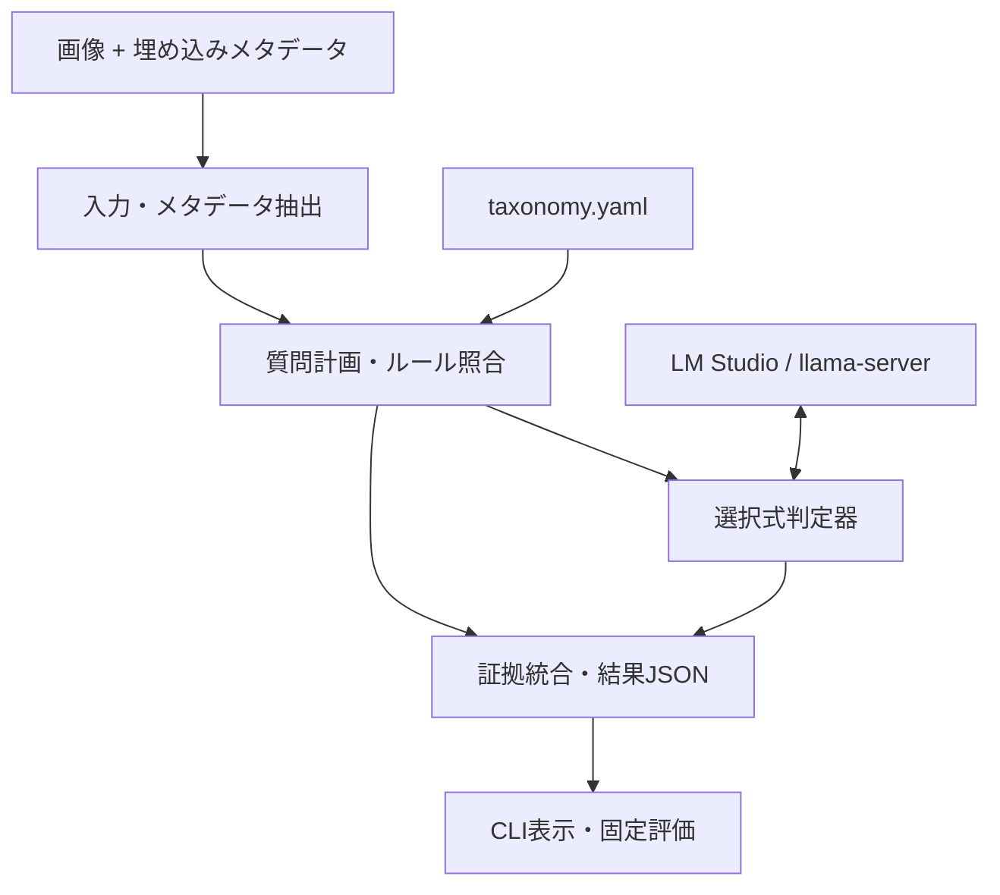

# ローカルVLM選択式画像分類デモ — 基本設計書

- 文書版: 0.3（通常JSON分類ベースラインを必須化）
- 作成日: 2026-09-23
- 対応要件: `requirements.md`

## 1. 設計原則

着想の系譜はJev、Google Gemmaの「DiffusionGemma as Jev」投稿とmmastrac氏による[vLLM PR #57250](https://github.com/vllm-project/vllm/pull/57250)、元アプリでの選択式VLM実装、本独立デモの順に記録する。PRではDiffusionGemmaのキャンバス上で回答スロット以外を固定した読み出しを可能にし、1トークンの選択肢とそのlogprobsを取得する。サンプルサーバーはJev風の`/v1/systemone`を実演するが、vLLM本体の標準エンドポイントではない。今回のQwen/Gemma 4実装は自己回帰モデルに画像と選択肢を渡し、chat completionsの回答ラベルのlogprobsを読む。両者のAPI、推論機構、速度の測定値を同一視しない。

分類器を依存の少ない純粋なコア、画像・メタデータ入力、推論APIアダプタ、表示・評価に分離する。既存の `自家製の画像分類アプリ(非公開)` の仕組みを設計上の出発点とし、必要なロジックをライセンスと履歴を確認して移植・簡素化する。privateリポジトリのDBや画面をそのままコピーしない。分類結果は入力、候補分布、メタデータの一致、最終判定の各段階を追跡できる構造にする。

## 2. システム構成



LM Studioは初回の接続・利用経路、llama-serverは画像キャッシュ改造の効果を示す比較経路とする。両者を同一のOpenAI互換chat completionsアダプタから呼ぶ。モデルの自動ダウンロード、サーバープロセスの自動起動・終了は行わず、ユーザーが起動したローカルサーバーに接続する。ポートやモデル名はCLIで明示する。

## 3. ディレクトリ案

```text
README.md
LICENSE
pyproject.toml
taxonomy/default.yaml
dataset/images/
dataset/manifest.jsonl
dataset/DATASET_CARD.md
classifier_demo/__main__.py
classifier_demo/models.py
classifier_demo/metadata.py
classifier_demo/taxonomy.py
classifier_demo/decision.py
classifier_demo/pipeline.py
classifier_demo/report.py
scripts/verify_dataset.py
scripts/evaluate.py
scripts/benchmark_cache.py
doc/llamacpp-cache-patch.md
doc/patches/llamacpp-mtmd-cache.patch
doc/experiments/
tests/
```

`dataset/images/` は新規生成・公開許諾確認済みの画像のみ。元プロジェクトから画像、学習素材、ユーザー固有のtaxonomy、DBをコピーしない。データセット全体が大きい場合はGit LFSまたは固定リリース資産とし、READMEの初回実行での取り方を単一手順にする。

## 4. 分類体系

### 4.1 軸と候補

初版は小さな固定体系とする。候補名と外見基準はデータセット完成後に確定し、その版をハッシュで固定する。

| 軸 | 候補例 | 複数可 | 備考 |
|---|---|---|---|
| `image_type` | illustration, comic, ui, other | いいえ | 画像の形式 |
| `art_style` | anime_2d, painterly_2d, pixel_art, other | いいえ | 画風。実写の生成は要件に含めない |
| `subject` | person, landscape, mecha_vehicle, object, creature, other | 必要なら | 一般カテゴリ。複数主題の扱いは正解付与規則で固定 |
| `character` | alisa, second_original, other_original | はい | 正確な容姿基準を公開版で記入する |

`other` は「該当なし」を表し、`character` に人物がいない場合と、人物はいるが候補外の場合を区別するため、必要なら `no_character` と `other_original` に分ける。候補の定義が不鮮明なときは推論前にtaxonomyを直し、評価後に都合よく変更しない。各軸・各候補はID、表示名、`criteria`、任意の`match_tags`、`required`、`multi`を持つ。候補数は1質問あたり19以下（`none`を含め最大20ラベル）に抑え、超過時は明示的にエラーか階層化する。

### 4.2 キャラの証拠

`fet_alisa_uniform` はLoRA指定名の照合対象。`<lora:fet_alisa_uniform:0.8>` 等の名前部分を抽出し、規定の大文字小文字・空白正規化後に**名前の完全一致**で照合する。重み値は証拠に保存するが、重みがあるだけで見た目への作用を保証しない。メタデータが欠けてもvision判定を省略しない。

キャラの外見基準は作者が具体的に記入し、曖昧な「似ている」だけにしない。特徴的な髪・瞳・服・装飾の組合せと、似た別キャラとの識別点を併記する。LoRA名は質問文中に正解を漏らさず、`vision_only`実験ではメタデータをモデルに一切渡さない。メタデータ補助モードは別条件として扱い、正解ラベルとの混同を避ける。

## 5. 分類アルゴリズム

1. 画像を読み込み、MIMEと寸法を検査。モデル送信用コピーだけを縮小する。画像のメタデータを抽出し、元の値と正規化後の値を保存する。
2. taxonomyに対しLoRA名・プロンプトタグの一致を計算し、`metadata_evidence`に保存する。プロンプト内の自由文から曖昧一致でキャラを確定しない。
3. 各軸の候補と判定基準を列挙し、「回答は1文字」の選択式質問を作る。画像と質問をローカルAPIへ渡し、`max_tokens=1`、`temperature=0`、`logprobs=true`、対応する`top_logprobs`を要求する。
4. `A`と` A`のような回答文字の表記差を吸収し、各ラベルの`exp(logprob)`を合計する。列挙した選択肢内で再正規化した**相対スコア**として保存する。選択肢のトークンが全く出ない、思考文が先に出る、logprobsが欠ける場合は明示的な失敗にし、任意の選択肢へ強制しない。
5. 複数可の`character`は候補を順位付けした後、規定数までを独立したyes/noで再確認する。相対候補スコアとyes/noスコアの両方を保持し、固定しきい値で最終タグにする。`other`は人物同定失敗のfallbackであり、候補確認のyes/no対象にしない。
6. メタデータ一致は別証拠として併記する。元実装ではルール一致をconfidence 1.0のタグに統合するが、公開デモは**メタデータで記録された指定**と**画素からの同定**を別フィールドで出し、食い違いを表面化する。統合表示は`confirmed_by_both`、`metadata_only`、`vision_only`、`conflict`、`unknown`などの説明用状態とし、ベンチマークではvision正解とメタデータ正解を個別採点する。
7. 最終結果、全候補分布、根拠、モデル設定、プロンプト、回数、経過時間、失敗理由をJSONに記録する。プロンプトに埋めるメタデータ文字列は命令として解釈しない旨を明記して長さを制限する。

ラベルスコアは、モデルが与えられた候補内でどれを選ぶ傾向があるかを表す。画像が現実にそのカテゴリである確率として表示せず、閾値は固定評価セットで校正する。質問の文言や選択肢の順序への依存を確認する評価も行う。

## 6. 推論アダプタ

### 6.1 共通契約

```python
class DecisionBackend:
    def probe(self) -> CapabilityReport: ...
    def choose(self, image: bytes, mime: str, question: str,
               choices: list[Choice]) -> ChoiceDistribution: ...
```

アダプタは`api_base`、`model_id`、APIキー（ローカルのダミー値）、タイムアウト、`reasoning_effort`の扱いを設定として保持する。`probe()`はテキストのみでは不十分であり、実画像を使った視覚入力とlogprobs確認を行う。モデルごとにthinking制御の可否を確認し、失敗したパラメータを外して再試行する場合はその事実をログに残す。モデルごとのテンプレートやレスポンス差はアダプタに閉じ込める。Gemmaで同じ契約が成立しない場合、別方式へ黙って切り替えず、実験結果として記録する。

### 6.2 実行プロファイル

| profile | モデル | サーバー | 意図 |
|---|---|---|---|
| `qwen-lmstudio` | 通常版Qwen3.5 9B GGUF | LM Studio | 利用しやすい基準 |
| `qwen-llama-stock` | 同上 | 上流llama-server | 未改造時の比較 |
| `qwen-llama-patched` | 同上 | 同じコミットの改造版 | 画像キャッシュの効果 |
| `gemma-sfw` | Gemma 4 12B itの対応GGUF | LM Studio（まず検証） | SFW範囲の速度・精度比較 |

GemmaのGGUF配布元、量子化、視覚コンポーネントは接続試験後に固定する。SFWケースでのGemmaの速さは過去の観察に基づく仮説として扱い、この専用セットで測り直す。QwenとGemmaの比較は同じ画像・軸・判定基準を使用し、モデルごとの量子化・ロード設定の違いを併記する。

## 7. llama.cpp画像キャッシュ改造

元プロジェクトの `docs/llamacpp-image-cache-patch.md` では、Qwen3.5系のハイブリッドattention + SSMと同一画像への連続質問で、画像部分が毎回再エンコードされる現象を記録している。元の実験では `tools/server/server-context.cpp` の `do_checkpoint = do_checkpoint && !has_mtmd;` を無効化し、同一画像・質問変更の小ベンチマークで0.596→0.106秒、アプリの8枚テストの単独質問で11.3→7.3秒を観測している。**これらは元プロジェクトの別条件での過去結果であり、本デモの実測値ではない。**

公開デモではパッチの対象を特定の上流コミットに固定し、差分ファイル、ビルド手順、生成バイナリID、未改造版への復帰、上流issueへのリンクを付ける。単に`git clone`した最新版へ無条件適用しない。未改造版と改造版を同一モデル・同一画像・同一設定で順に起動し、プロセスが残っていないことを確認してから測定する。画像A→異なる質問を繰り返すマイクロベンチと、全軸のアプリ測定を分ける。出力タグの一致を確認し、速度だけ改善して判定が変わる場合は改造版を推奨しない。上流が修正済みならパッチを再評価して不要と記す。Gemmaへの効果は未検証なので、Qwenの数字を適用しない。

## 8. データ構造と出力例

```json
{
  "case_id": "demo-001",
  "source_image_id": "source-001",
  "dataset_version": "v1.0.0",
  "profile": "qwen-llama-stock",
  "model": {"id": "<server model id>", "file_sha256": "<sha256>", "runtime_commit": "<sha>"},
  "taxonomy_sha256": "<sha256>",
  "metadata_evidence": [{"kind": "lora_name", "value": "fet_alisa_uniform", "weight": 0.8, "matched_character": "alisa"}],
  "axis_decisions": {"character": {"choices": {"alisa": 0.83, "second_original": 0.12, "other_original": 0.05}, "confirmations": {"alisa": 0.94}}},
  "vision_tags": {"character": ["alisa"]},
  "combined_evidence": {"alisa": "confirmed_by_both"},
  "timing_ms": {"total": 7123},
  "request_count": 6,
  "errors": []
}
```

数値は形式例であり測定値ではない。正解データにはモデル結果を入れず、評価時にcase_idで突合する。生画像やbase64、プロンプト全文は結果JSONに複製しない。実行環境の個人パスは公開レポートから除去する。

## 9. CLI・評価インターフェース

```text
python -m classifier_demo probe --profile qwen-lmstudio
python -m classifier_demo classify dataset/images/demo-001.png --profile qwen-lmstudio --output results/demo-001.json
python -m classifier_demo evaluate --manifest dataset/manifest.jsonl --profile qwen-lmstudio --output results/qwen-lmstudio/
```

`evaluate`はmanifestにない画像を拾わず、権利未確認ケースの公開用結果への混入を防ぐ。評価レポートには失敗も含むcaseごとのCSV、軸別集計、キャラのprecision/recall/F1、subsetごとの速度中央値・分位点、メタデータあり/なしの差、元画像グループ単位の数を出す。低標本数では点推定を強い結論として書かず、件数と個別例を併記する。

### 9.1 通常JSON分類ベースライン

同じ画像とtaxonomyから、全軸の選択肢・判定基準を1回のVLMプロンプトに列挙し、`{"image_type": "...", "art_style": "...", "subject": ["..."], "character": ["..."]}` のJSONのみを生成させる。`character`は複数名を許す。出力形式と解釈規則を実験前に固定し、選択式と同じ正解付与規則・指標で採点する。分類ベースラインには要約文を要求しない。要約付きの一般的な利用例も見せる場合は別実験とし、出力トークン数と時間を分けて報告する。

パーサーはコードフェンス除去等の許容範囲をあらかじめ決め、未知の候補や欠損軸を勝手に正解へ補正しない。1回目の生成と構文解析に要した時間、所定の再試行回数、再試行を含む最終時間、形式不正率、未解決エラーを保存する。どちらの方式も同じモデル・同じGGUF・同じサーバー設定・同じ画素入力・同じtaxonomy版で対応比較する。メタデータ補助の有無も揃え、JSON方式にだけ正解のLoRA名をヒントとして渡すことはしない。測定順序の偏りを避け、モデルロード・ウォームアップは別計測とする。

## 10. 設計上の検証点

| リスク | 対策・検証 |
|---|---|
| 通常版Qwenで回答文字の前にthinkingが出る | probeで検出。thinking制御とパラメータ有無を記録。不能ならfast mode非対応と報告 |
| GGUFごとのvision・logprobs差 | モデルID、mmproj、サーバーの機能試験を必須化 |
| 画像キャッシュ改造の状態復元 | 同じ質問の繰り返し、画像切替A→B→A、結果差分を測る |
| メタデータを変更した対照画像の採点混同 | 同一`source_image_id`で束ね、vision正解とmetadata正解を別扱い |
| LoRA名による画像同定の過信 | LoRA指定を証拠に留め、メタデータのみの結果を別表示 |
| JSON方式に余分な生成作業を課す | 主比較は分類フィールドのみ。説明文付きは別表にし、出力トークン数を示す |
| 公開した画像の権利・個人情報 | manifestの権利確認と公開前の全画像・履歴点検 |

## 11. 参考資料

- 元実装: `自家製の画像分類アプリ(非公開)` の `sdic/decision_provider.py`、`sdic/taxonomy_grow.py`、`sdic/metadata.py`、`docs/llamacpp-image-cache-patch.md`（2026-09-23確認）。
- 上流の関連議論: https://github.com/ggml-org/llama.cpp/issues/26994
- 着想元のPR: https://github.com/vllm-project/vllm/pull/57250 （2026-09-22マージ）。紹介投稿: https://x.com/googlegemma/status/2101069861598482817
- Qwen公式モデル: https://huggingface.co/Qwen/Qwen3.5-9B
- Gemma公式モデル: https://huggingface.co/google/gemma-4-12B-it
